# Dithers - Rust Image Dithering Library & CLI

A flexible **Rust image dithering toolkit** for applying various dithering algorithms to images.

A toolkit featuring 13 different dithering algorithms and 3 color palettes.

## Features

### Dithering Algorithms

- **Floyd-Steinberg** - Classic error diffusion algorithm
- **Jarvis, Judice, Ninke** - Enhanced error diffusion
- **Stucki** - High-quality error diffusion
- **Atkinson** - Apple's dithering algorithm
- **Burkes** - Fast error diffusion variant
- **Sierra** - Three-row error diffusion
- **Two-Row Sierra** - Simplified Sierra algorithm
- **Sierra Lite** - Lightweight Sierra variant
- **Bayer 2x2, 4x4, 8x8** - Ordered dithering matrices
- **Simple 2D** - Basic ordered dithering

### Color Palettes

- **Monochrome** (2 colors) - Classic black and white
- **8-Color** - Primary color palette
- **16-Color** - Extended color palette with better gradients

### Usage Options

- **CLI Tool** - Command-line interface for batch processing
- **Rust Library** - Integrate dithering into your Rust projects

## Dithering Algorithm Gallery

### Original Image


### Error Diffusion Algorithms

#### Floyd-Steinberg (Classic)

| Monochrome                                              | 8-Color                                             | 16-Color                                              |
| ------------------------------------------------------- | --------------------------------------------------- | ----------------------------------------------------- |
|  | 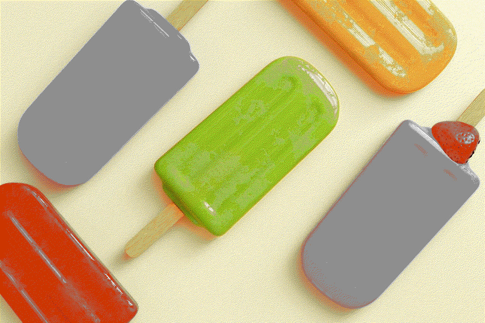 |  |

#### Jarvis, Judice & Ninke

| Monochrome                                      | 8-Color                                     |
| ----------------------------------------------- | ------------------------------------------- |
|  |  |

#### Atkinson (Apple's Algorithm)

| Monochrome                                          | 8-Color                                         |
| --------------------------------------------------- | ----------------------------------------------- |
|  | 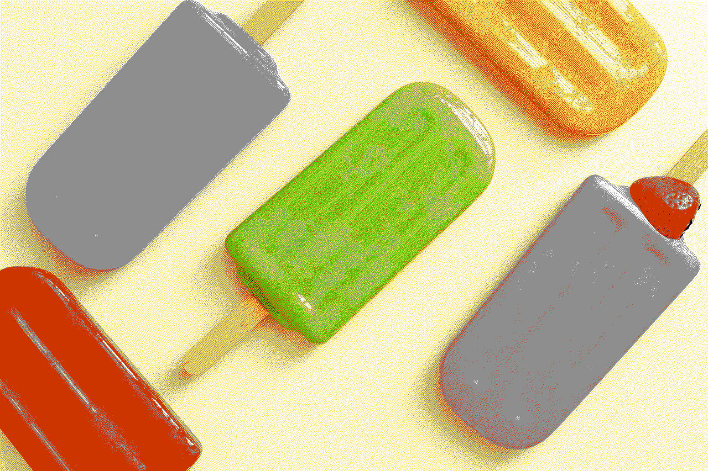 |

#### Stucki

| Monochrome                                      | 16-Color                                      |
| ----------------------------------------------- | --------------------------------------------- |
| 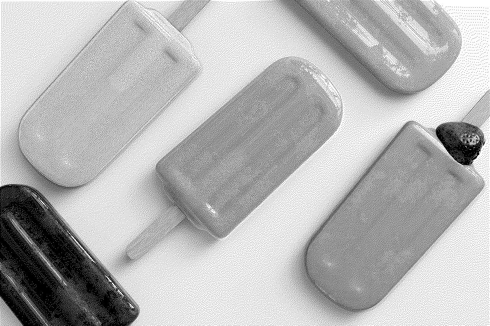 | 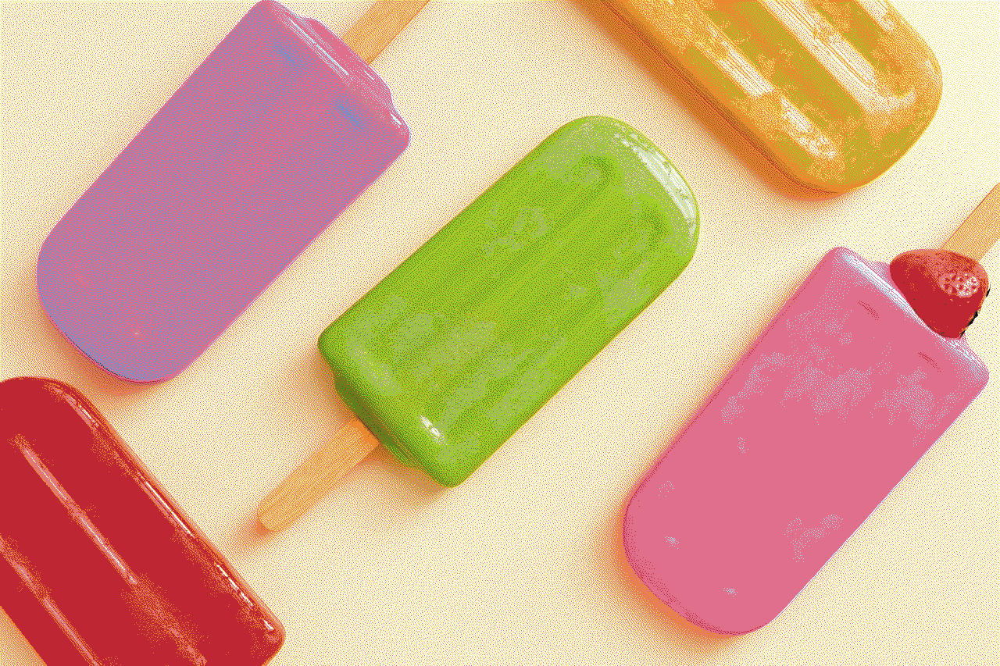 |

#### Sierra Family

| Sierra (Monochrome)                             | Sierra (16-Color)                             | Two-Row Sierra (8-Color)                                    | Sierra Lite (Monochrome)                                  |
| ----------------------------------------------- | --------------------------------------------- | ----------------------------------------------------------- | --------------------------------------------------------- |
|  |  |  |  |

#### Other Error Diffusion

| Burkes (8-Color)                            | Simple2D (8-Color)                              |
| ------------------------------------------- | ----------------------------------------------- |
|  | 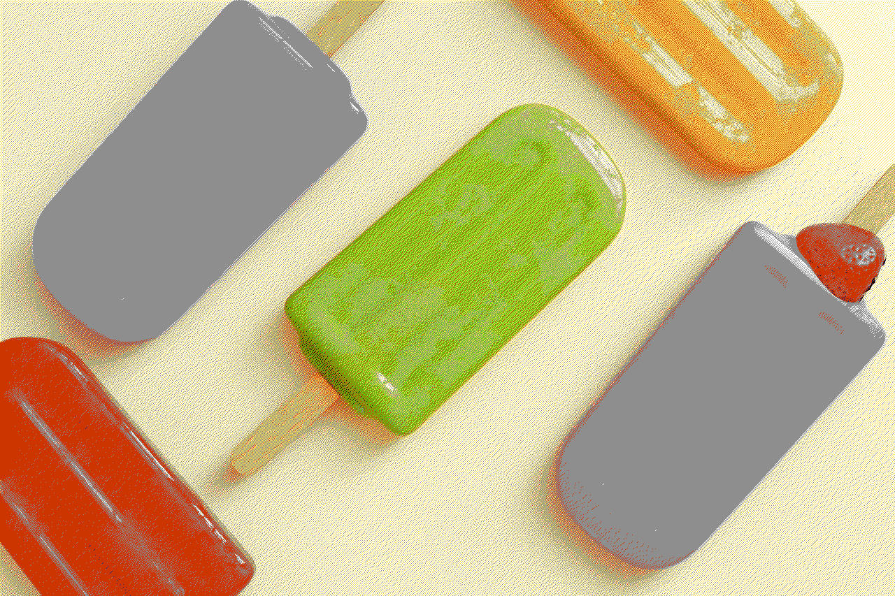 |

### Ordered Dithering (Bayer Matrices)

#### Bayer 2×2 Matrix

| Monochrome                                          | 8-Color                                         |
| --------------------------------------------------- | ----------------------------------------------- |
| 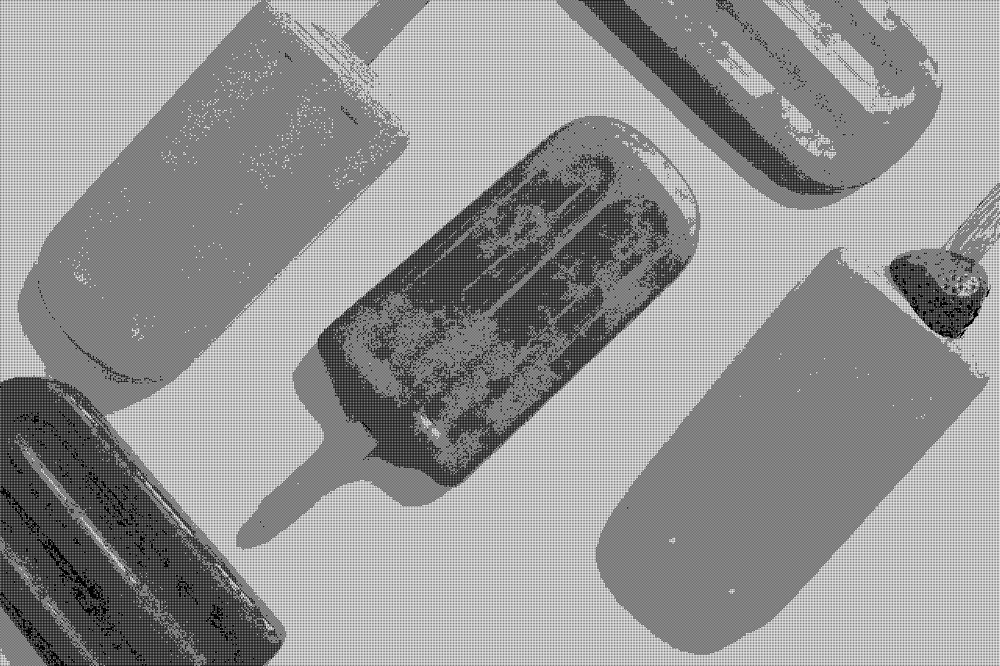 |  |

#### Bayer 4×4 Matrix

| Monochrome                                          | 16-Color                                          |
| --------------------------------------------------- | ------------------------------------------------- |
|  | 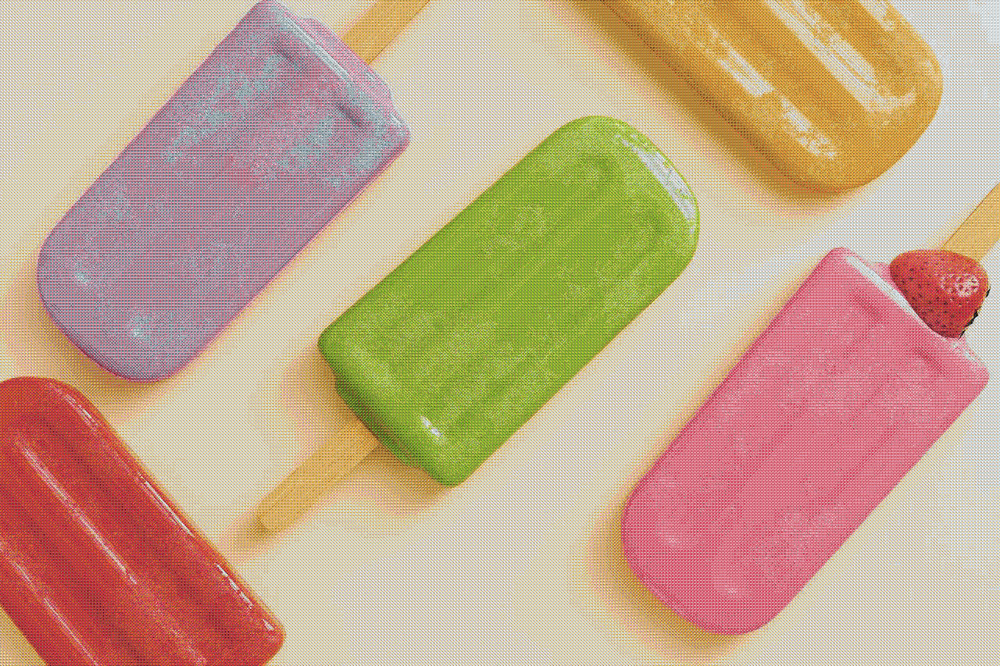 |

#### Bayer 8×8 Matrix

| Monochrome                                          | 8-Color                                         |
| --------------------------------------------------- | ----------------------------------------------- |
| 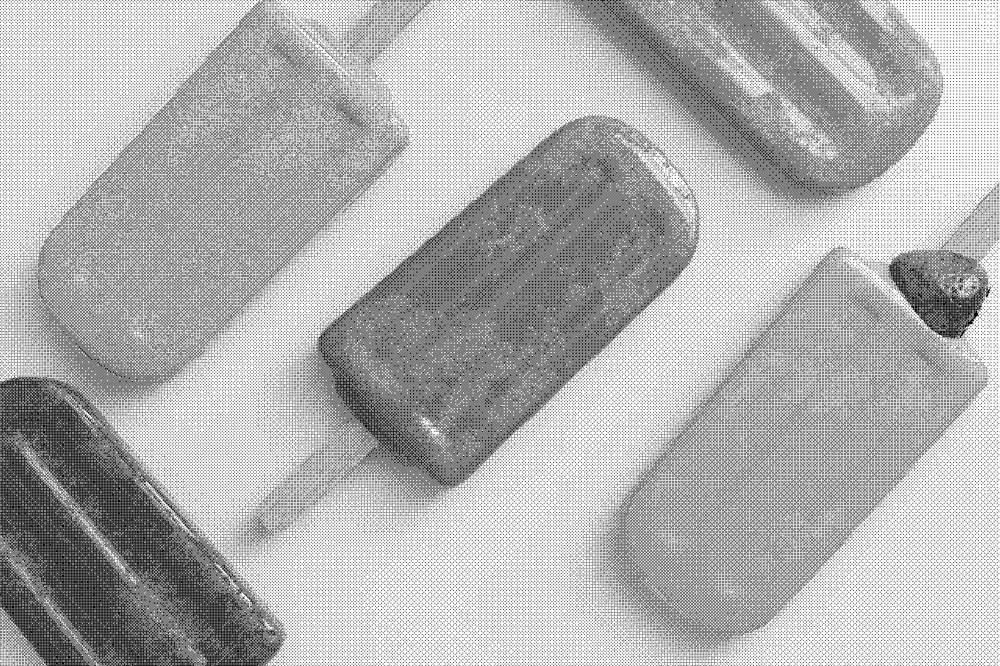 | 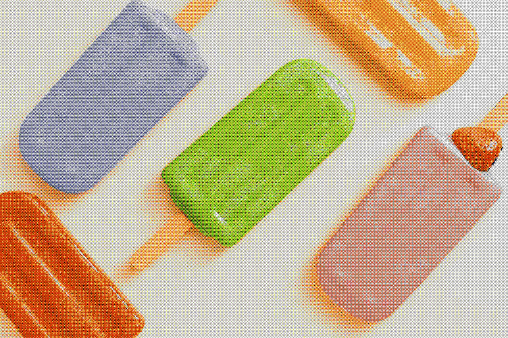 |

### No Dithering (Palette Quantization Only)

| Monochrome                                  | 8-Color                                 |
| ------------------------------------------- | --------------------------------------- |
| 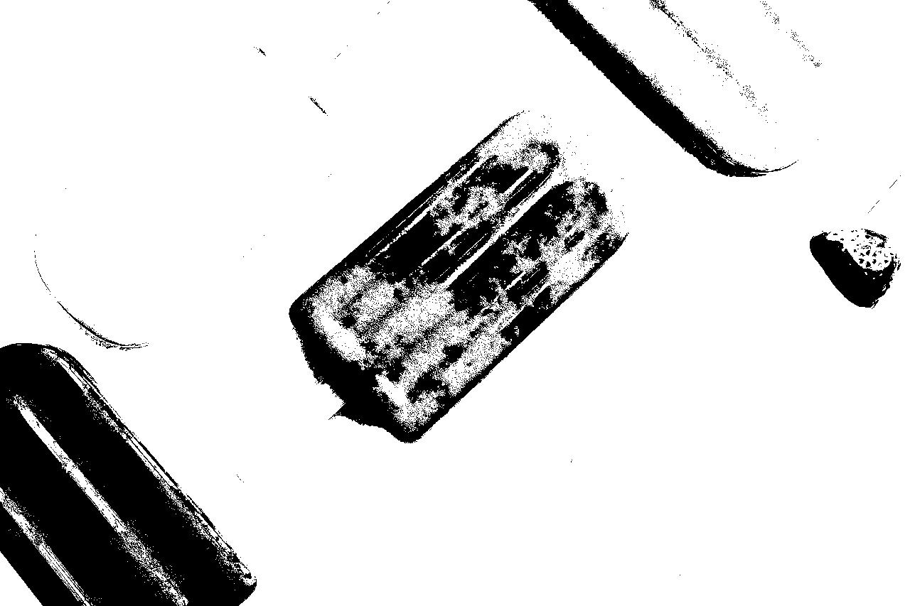 | 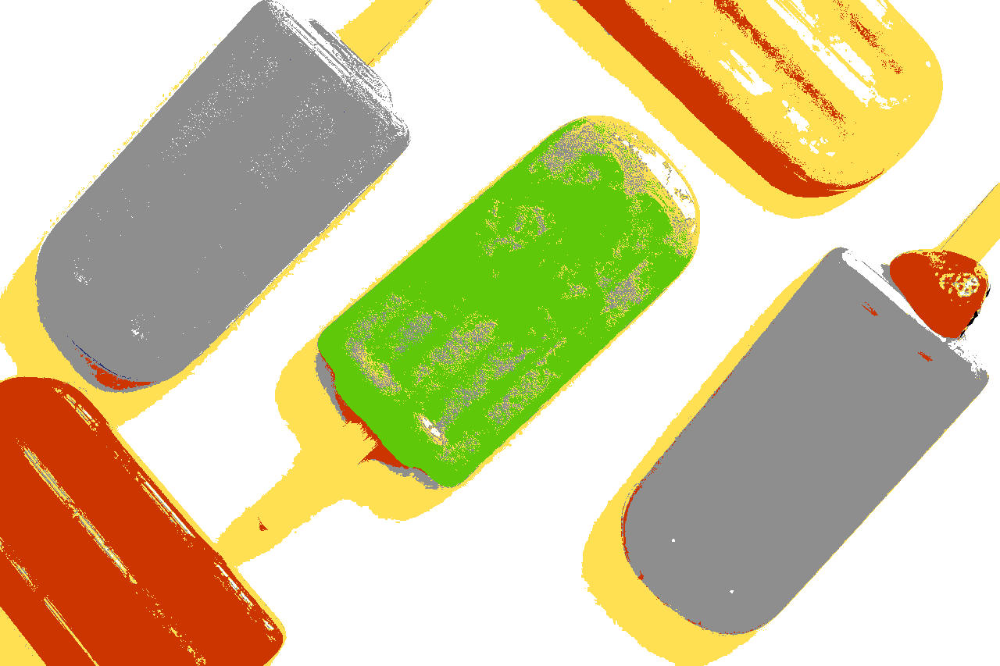 |

> **Note:** Generate your own samples with `just generate-samples` to see all 23 combinations!

---

## Project Structure

```
dithers/                # package name: dithers
├── Cargo.toml
└── src/
    ├── main.rs        # binary: dithers
    ├── lib.rs         # library: dithers
    ├── dither.rs      # dithering algorithms
    ├── palette.rs     # color palettes
    └── args.rs        # CLI arguments
```

---

## CLI Usage

### Installation & Build

```bash
git clone <repository-url>
cd dithers
cargo build --release
```

### Basic Usage

```bash
# Floyd-Steinberg with monochrome palette
./target/release/dithers -i input.jpg -o output.png -d floyd-steinberg -c monochrome

# Atkinson with 8-color palette
./target/release/dithers -i input.jpg -o output.png -d atkinson -c color8

# Bayer 4x4 with 16-color palette
./target/release/dithers -i input.jpg -o output.png -d bayer4x4 -c color16
```

### Command-Line Options

```
Options:
  -i, --in <PATH>         Input image file
  -o, --out <PATH>        Output image file (optional, defaults to input_out.ext)
  -d, --dither <METHOD>   Dithering algorithm [default: floyd-steinberg]
  -c, --color <PALETTE>   Color palette [default: monochrome]
```

### Available Algorithms

- `floyd-steinberg` (default)
- `jarvis`
- `stucki`
- `atkinson`
- `burkes`
- `sierra`
- `two-row-sierra`
- `sierra-lite`
- `bayer2x2`
- `bayer4x4`
- `bayer8x8`
- `simple2d`
- `none` (palette quantization only)

### Available Palettes

- `monochrome` (default) - Black and white
- `color8` - 8-color palette
- `color16` - 16-color palette

---

## Library Usage

Add to your `Cargo.toml`:

```toml
[dependencies]
dithers = { path = "path/to/dithers" }
```

### Basic Example

```rust
use dithers::dither::{open_image, dither, save_image, DitherMethod};
use dithers::palette::ColorPalette;
use std::path::PathBuf;

fn main() {
    // Load image
    let (mut buffer, width, height) = open_image(&PathBuf::from("input.jpg"));

    // Apply dithering
    dither(&mut buffer, DitherMethod::FloydSteinberg, ColorPalette::Monochrome, width, height);

    // Save result
    save_image(buffer, PathBuf::from("output.png"), width, height);
}
```

### Advanced Usage

```rust
use dithers::dither::DitherMethod;
use dithers::palette::{ColorPalette, map_to_palette, Color};

// Custom dithering with different algorithms
let methods = [
    DitherMethod::FloydSteinberg,
    DitherMethod::Atkinson,
    DitherMethod::Bayer4x4,
];

for method in methods {
    dither(&mut buffer.clone(), method, ColorPalette::COLOR16, width, height);
}
```

## Algorithm Comparison

### Error Diffusion vs Ordered Dithering

**Error Diffusion** (Floyd-Steinberg, Jarvis, Atkinson, etc.):

- ✅ **Better visual quality** - More natural-looking results
- ✅ **Good for organic images** - Excellent for photos and artwork
- ✅ **Smooth gradients** - Creates pleasing transitions
- ⚠️ **Slower processing** - Sequential pixel processing
- ⚠️ **Pattern-sensitive** - Can create artifacts in regular patterns

**Ordered Dithering** (Bayer matrices):

- ✅ **Fast processing** - Parallelizable algorithm
- ✅ **Consistent patterns** - Predictable, regular texture
- ✅ **Good for graphics** - Works well with geometric shapes
- ⚠️ **Visible patterns** - Regular dot/grid patterns may be noticeable
- ⚠️ **Less organic** - Can look artificial on photographs

### When to Use Each Algorithm

| Use Case                   | Recommended Algorithm             | Palette           |
| -------------------------- | --------------------------------- | ----------------- |
| **Photographs**            | Floyd-Steinberg, Jarvis, Atkinson | 8-Color, 16-Color |
| **Artwork/Illustrations**  | Stucki, Sierra, Floyd-Steinberg   | 16-Color          |
| **Retro Gaming Look**      | Bayer 2×2, Bayer 4×4              | 8-Color           |
| **Print/Newspaper Style**  | Floyd-Steinberg, Atkinson         | Monochrome        |
| **Fast Processing**        | Bayer 4×4, Bayer 8×8              | Any               |
| **Vintage Computer Style** | Simple2D, Bayer 2×2               | 8-Color           |

---

## Performance

The library is designed for performance:

- Efficient error diffusion algorithms
- Optimized color distance calculations
- Single-pass processing
- Memory-efficient buffer operations

---

## Generating Samples

You can generate your own sample images using the provided justfile commands:

### Generate All Algorithm Samples

```bash
just generate-samples
```

This creates 23 sample images covering all dithering algorithms:

- **Error diffusion**: Floyd-Steinberg, Jarvis, Atkinson, Stucki, Burkes, Sierra variants, Simple2D
- **Ordered dithering**: Bayer 2×2, 4×4, and 8×8 matrices
- **No dithering**: Palette quantization only

### Clean Up Samples

```bash
just clean-samples
```

Removes all generated sample files to keep the repository clean.

### Custom Sample Generation

Generate specific combinations manually:

```bash
# High-quality error diffusion with 16 colors
cargo run -- -i test/in/glace-1280_853.jpg -o my-sample.jpg -d floyd-steinberg -c color16

# Retro gaming style with Bayer dithering
cargo run -- -i test/in/glace-1280_853.jpg -o retro-sample.jpg -d bayer2x2 -c color8

# Classic newspaper style
cargo run -- -i test/in/glace-1280_853.jpg -o newspaper-sample.jpg -d atkinson -c monochrome
```

---

## Contributing

Contributions are welcome! Areas for improvement:

- Additional dithering algorithms
- Custom color palette support
- Performance optimizations
- More image format support

---

## License

[License information - check LICENSE file]

---

## Acknowledgments

Implements classical dithering algorithms developed by:

- Floyd & Steinberg (1976)
- Jarvis, Judice & Ninke (1976)
- Bill Atkinson (Apple)
- And other pioneers in computer graphics
